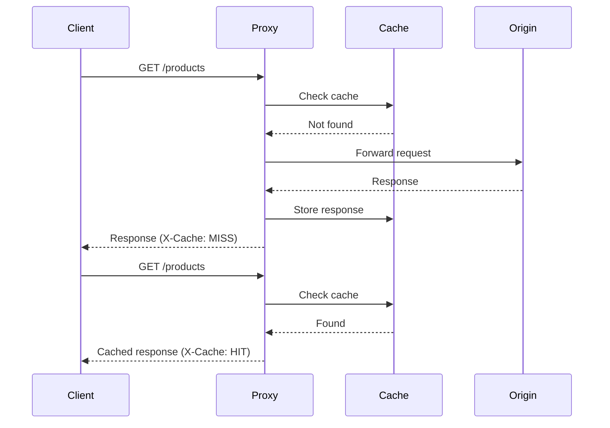

# Caching Proxy Server

This project implements a simple caching proxy server in Python. The server forwards incoming HTTP requests to an origin server and caches the responses. When the same request is made again, the server returns the cached response instead of forwarding the request to the origin server.

## System Design
Below is a sequence diagram showing how the caching proxy server handles requests:



## Features:
- **Cache HTTP responses**: The server caches responses from the origin server based on the requested URL path.
- **Cache HIT/MISS headers**: Each response contains an `X-Cache` header indicating whether the response was served from the cache (`HIT`) or fetched from the origin server (`MISS`).
- **Command-line interface (CLI)**:
  - Start the proxy server.
  - Clear the cache.

## Requirements:
- Python 3.x
- `requests` library
- `cachetools` library

You can install the required libraries using:

```bash
pip install requests cachetools
```

This README provides all the necessary information for users to understand, set up, and run the caching proxy server.
[ProjectIdeaFrom](https://roadmap.sh/projects/caching-server)
